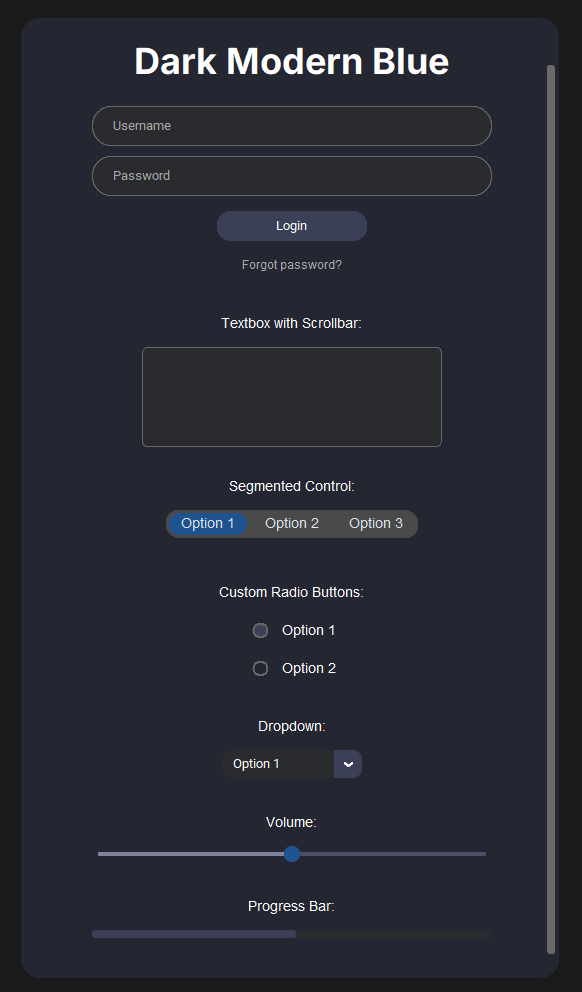

# DarkModernBlue UI Design

A modern, dark-themed UI design built with [CustomTkinter](https://github.com/TomSchimansky/CustomTkinter).
The **DarkModernBlue** style is characterised by an anthracite background with blue accents and includes various custom widgets such as a text field (password, scrollable), segmented controls, custom radio buttons, drop-down menus, sliders and more.

## Features

- **Custom Widgets:**
  - **Segmented Control:** CTkSegmentedButton` for selection
  - **Custom Radio Buttons:** `Canvas` for a modern look
- **Scrollable Layout:** Uses `CTkScrollableFrame` for automatically handling overflow.
- **Easy Customization:** Global color variables make it simple to adjust the theme.



## Prerequisites

- Python 3.x  
- [CustomTkinter](https://github.com/TomSchimansky/CustomTkinter)  
  Install via pip:
  ```bash
  pip install customtkinter
